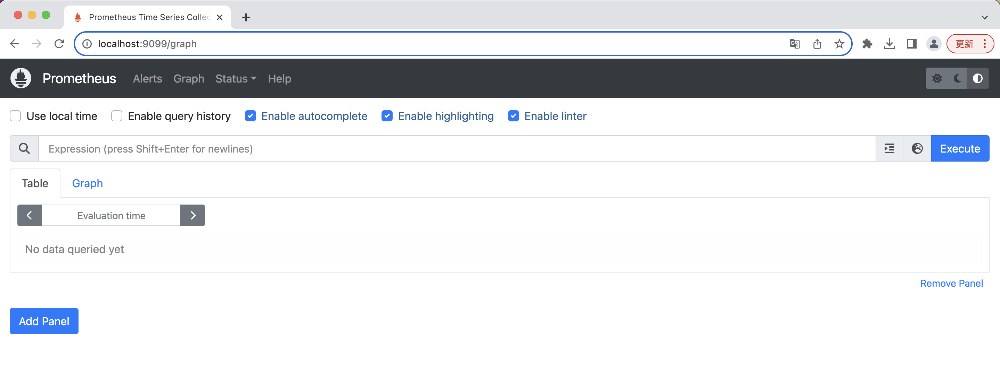
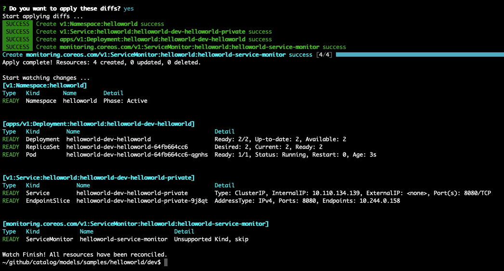
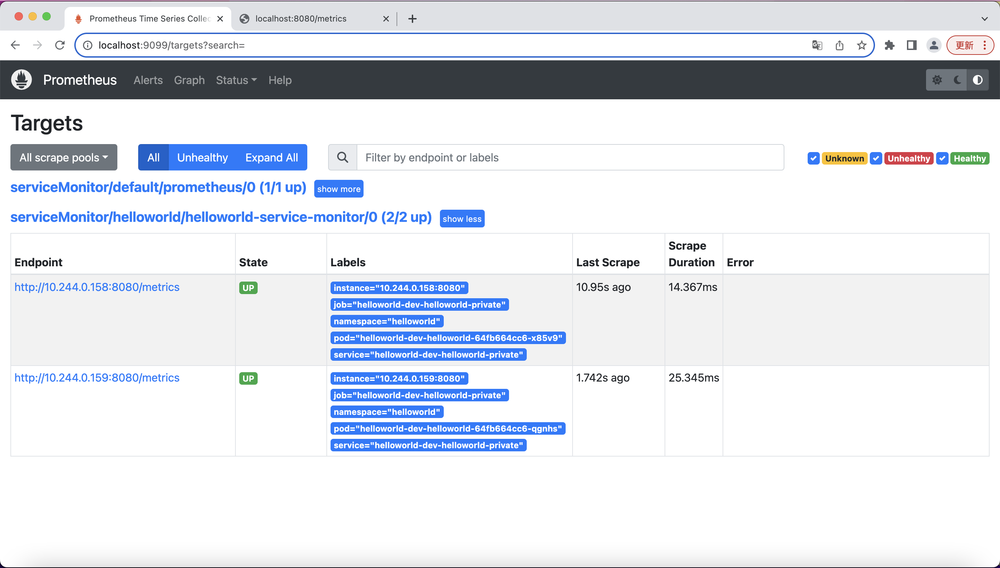

# Using Kusion to configure monitoring configuration

## Purpose
This document provides the step-by-step instruction to set up monitoring for your application. 

As of today, kusion supports the configuration of Prometheus scraping behaviors for the target application. In the future, we will add more cloud-provider-native solutions, such as AWS CloudWatch, Azure Monitor, etc.

## Background
### Prometheus
Prometheus is an open-source systems monitoring and alerting toolkit originally built at SoundCloud and has now become the de facto standard for cloud-native monitoring solutions. Prometheus collects and stores its metrics as time series data, i.e. metrics information is stored with the timestamp at which it was recorded, alongside optional key-value pairs called labels<sup>[1]</sup>.

### AWS CloudWatch
To be added.

### Azure Monitor
To be added.

## Setting up your own Prometheus

There a quite a few ways to set up Prometheus in your cluster:
1. Installing a Prometheus operator
2. Installing a standalone Prometheus server
3. Installing a Prometheus agent and connect to a remote Prometheus server

[The advice from the Prometheus team](https://github.com/prometheus-operator/prometheus-operator/issues/1547#issuecomment-401092041) is to use the `ServiceMonitor` or `PodMonitor` CRs via the Prometheus operator to manage scrape configs going forward<sup>[2]</sup>.

In either case, you only have to do this setup once per cluster. This doc will use a minikube cluster as an example.

### Installing Prometheus operator<sup>[3]</sup>.
To get the example in this user guide working, all you need is a running Prometheus operator. You can have that installed by running:
```
LATEST=$(curl -s https://api.github.com/repos/prometheus-operator/prometheus-operator/releases/latest | jq -cr .tag_name)
curl -sL https://github.com/prometheus-operator/prometheus-operator/releases/download/${LATEST}/bundle.yaml | kubectl create -f -
```

This will install all the necessary CRDs and the Prometheus operator itself in the default namespace. Wait a few minutes, you can confirm the operator is up by running: 
```
kubectl wait --for=condition=Ready pods -l  app.kubernetes.io/name=prometheus-operator -n default
```

### Make sure RBAC is properly set up
If you have RBAC enabled on the cluster, the following must be created for Prometheus to work properly:
```
apiVersion: v1
kind: ServiceAccount
metadata:
  name: prometheus
---
apiVersion: rbac.authorization.k8s.io/v1
kind: ClusterRole
metadata:
  name: prometheus
rules:
- apiGroups: [""]
  resources:
  - nodes
  - nodes/metrics
  - services
  - endpoints
  - pods
  verbs: ["get", "list", "watch"]
- apiGroups: [""]
  resources:
  - configmaps
  verbs: ["get"]
- apiGroups:
  - networking.k8s.io
  resources:
  - ingresses
  verbs: ["get", "list", "watch"]
- nonResourceURLs: ["/metrics"]
  verbs: ["get"]
---
apiVersion: rbac.authorization.k8s.io/v1
kind: ClusterRoleBinding
metadata:
  name: prometheus
roleRef:
  apiGroup: rbac.authorization.k8s.io
  kind: ClusterRole
  name: prometheus
subjects:
- kind: ServiceAccount
  name: prometheus
  namespace: default
```

### Configure Prometheus instance via the operator
Once all of the above is set up, you can then configure the Prometheus instance via the operator:
```
apiVersion: monitoring.coreos.com/v1
kind: Prometheus
metadata:
  name: prometheus
spec:
  serviceAccountName: prometheus
  serviceMonitorNamespaceSelector: {}
  serviceMonitorSelector: {}
  podMonitorNamespaceSelector: {}
  podMonitorSelector: {}
  resources:
    requests:
      memory: 400Mi
```
This Prometheus instance above will be cluster-wide, picking up ALL the service monitors and pod monitors across ALL the namespaces.
You can adjust the requests and limits accordingly if you have a larger cluster.

### Exposing the Prometheus portal (optional)
Once you have the managed Prometheus instance created via the Prometheus CR above, you should be able to see a service created called `prometheus-operated`:


If you are also running on minikube, you can expose it onto your localhost via kubectl:
```
kubectl port-forward svc/prometheus-operated 9099:9090
``` 

You should then be able to see the Prometheus portal via `localhost:9099` in your browser:


If you are running a non-local cluster, you can try to expose it via another way, through an ingress controller for example.

## Using kusion to deploy your application with monitoring requirements

At this point we are set up for good! Any new applications you deploy via kusion will now automatically have the monitoring-related resources created, should you declare you want it.  
The monitoring in an AppConfiguration is declared in the `monitoring` field. See the example below for a full, deployable AppConfiguration:

`base.k`:
```
import models.schema.v1 as ac
import models.schema.v1.workload as wl
import models.schema.v1.workload.container as c
import models.schema.v1.monitoring as m
import models.schema.v1.workload.network as n

appConfiguration = ac.AppConfiguration {
    workload: wl.Service {
        containers: {
            "nginx": c.Container {
                image: "quay.io/brancz/prometheus-example-app:v0.3.0"
            }
        }
        ports: [
            n.Port {
                port: 8080
            }
        ]
    }
    monitoring: m.Prometheus{
        interval:       "30s"
        timeout:        "15s"
        path:           "/metrics"
        scheme:         "http"
    }
}
```

The KCL file above represents an application with a service type workload, exposing the port 8080, and would like Prometheus to scrape the `/metrics` endpoint every 30 seconds.

Running `kusion apply` would show that kusion will create a `Namespace`, a `Deployment`, a `Service` and a `ServiceMonitor`:


Continue applying all resources:


If we want to, we can verify the service monitor has been created successfully:


In a few seconds, you should be able to see in the Prometheus portal that the service we just deployed has now been discovered and monitored by Prometheus:


You can run a few simply queries for the data that Prometheus scraped from your application:


For more about PromQL, you can find them [here](https://prometheus.io/docs/prometheus/latest/querying/basics/)<sup>[4]</sup>.

## References
1. Prometheus: https://prometheus.io/docs/introduction/overview/
2. Prometheus team advise: https://github.com/prometheus-operator/prometheus-operator/issues/1547#issuecomment-446691500
3. Prometheus operator getting started doc: https://github.com/prometheus-operator/prometheus-operator/blob/main/Documentation/user-guides/getting-started.md
4. PromQL basics: https://prometheus.io/docs/prometheus/latest/querying/basics/
